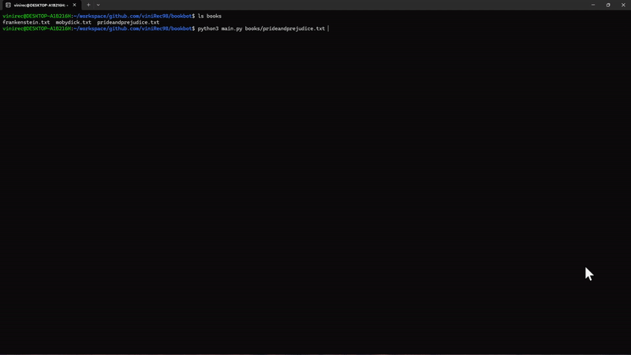

# Bookbot 🕮

**BookBot** is a **Python** program that analyzes novels and prints a statistical report of the word and character usage found within.


## Demo



## Getting Started

```bash
git clone https://github.com/viniRec98/bookbot
cd bookbot
python3 main.py <path_to_book>

